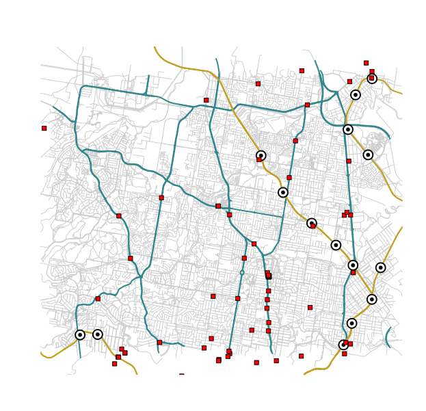

# BCC Real-time vehicle tracking
Brisbane City Council TransLink GTFS Real-Time Feed Processing in R

This respository uses an example of a feed snapshotted from a while ago, as a proof of concept.
The current feed specification and live files are available at: https://gtfsrt.api.translink.com.au/

The OpenStreetMap basemap vector data (osm_australia/australia-latest.osm.pbf) is pulled from https://download.geofabrik.de/australia-oceania/australia.html - it's not stored here due to size limitations.

## Example output

